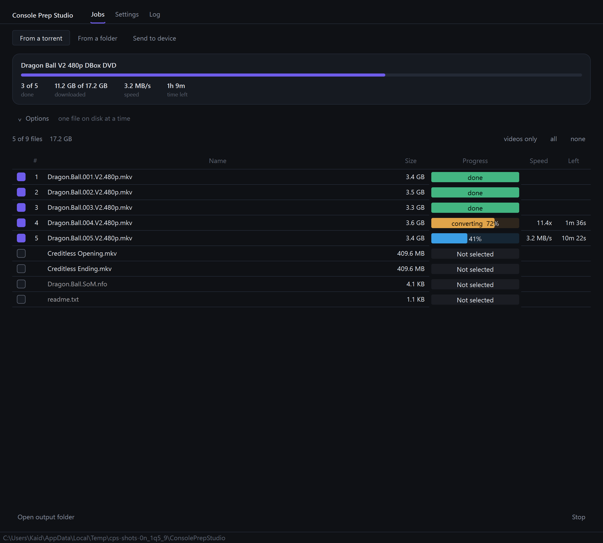
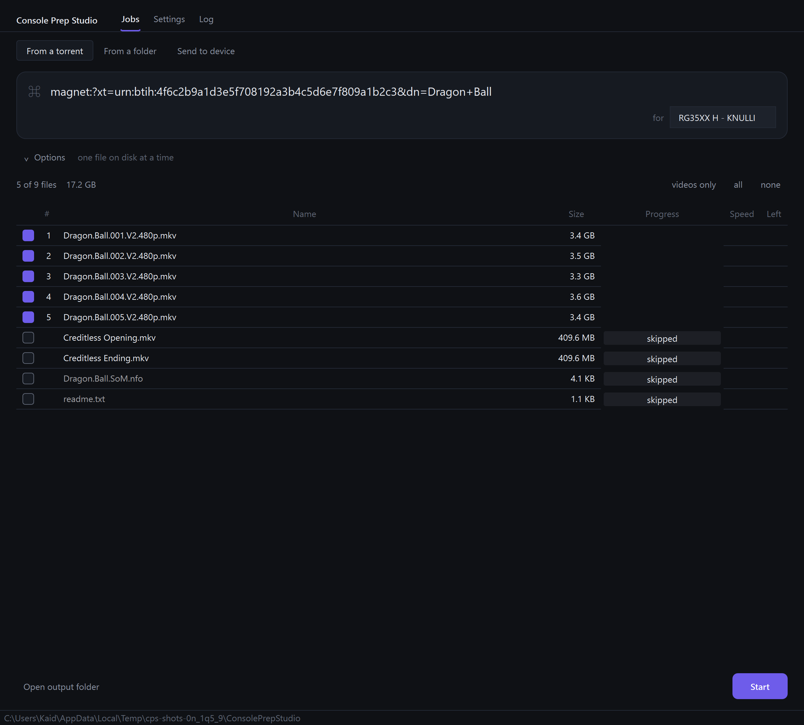
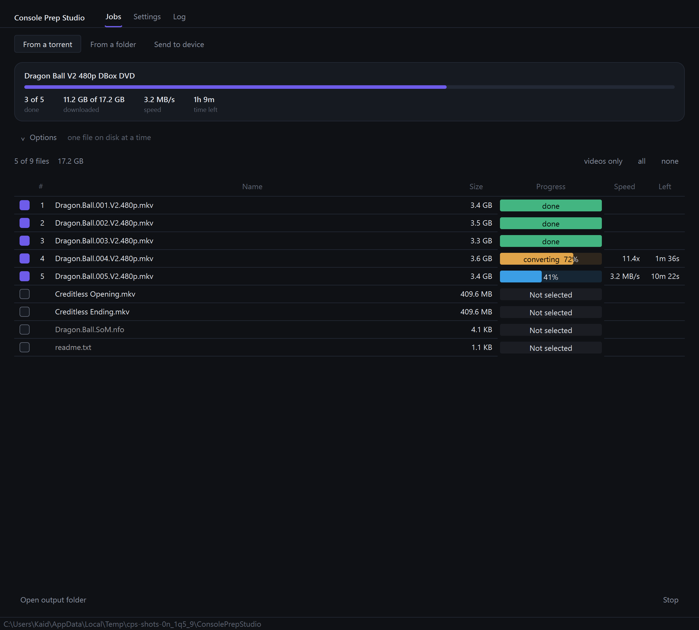
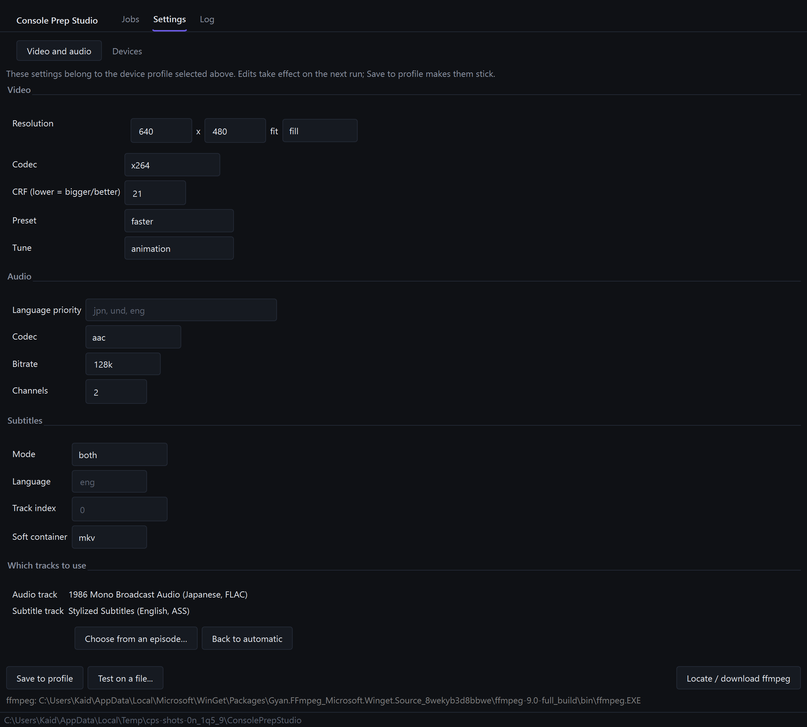
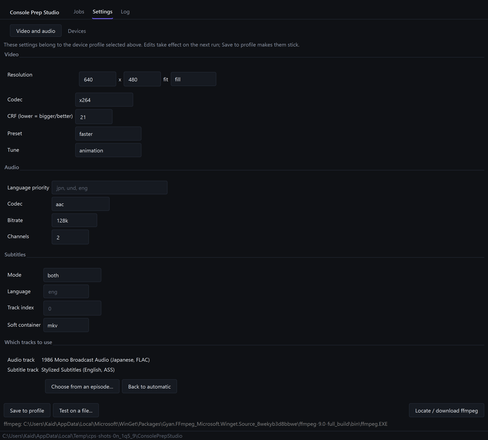
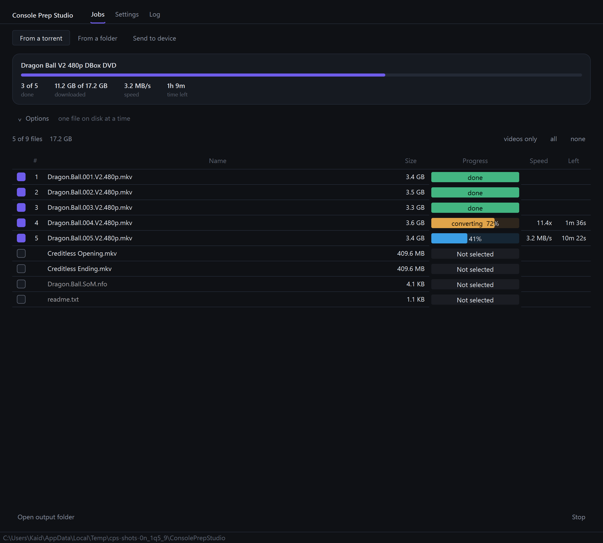

# Console Prep Studio

Turn a torrent into handheld-ready video, one episode at a time, without ever holding the
whole season on disk.

Point it at a magnet link, tick the episodes you want, and walk away. For each one it
downloads **only that file**, re-encodes it for your handheld's screen, writes out a
subtitled copy, deletes the source, and moves on. When the batch is done it copies
everything to the device over the network.

Built for an Anbernic RG35XX H running [KNULLI](https://knulli.org/) — Japanese audio,
English subtitles, 640×480 — but the device settings are just a profile, so it works for
any console you can reach over SSH, SMB, or an SD card.



## Why it exists

A season pack is 90 GB. A handheld holds 64 GB. Converting episode-by-episode by hand is
an evening of babysitting ffmpeg. This does the whole loop unattended and never needs more
than one raw episode of free space.

## What it does

1. **Reads the torrent** and shows you every file inside it, with the episode number it
   detected. Videos are ticked, extras and `.nfo` junk are not.
2. **Downloads one file**, using per-file priorities so the rest of the pack stays off disk.
3. **Converts it** — scales to the panel resolution, picks the audio track by language,
   and writes a soft-subtitled `.mkv`, a burned-in `.mp4`, or both.
4. **Deletes the source** (optional) and starts the next one.
5. **Sends the batch** to the device and runs a post-copy hook, like refreshing KNULLI's
   game list.

Already have the files? The **Convert files** tab does steps 3–5 on any folder you point
it at — no torrent involved.

State is saved continuously, so you can close the app mid-season and pick up where you
left off.

## Screenshots

| | |
|---|---|
|  **Pick what you actually want.** Every file in the torrent, with detected episode numbers. Pad files are hidden; extras are left unticked. |  **Convert files you already have.** Point it at a folder, tick what to convert, same settings and progress as a torrent job. |
|  **Compression.** Resolution, codec, quality, audio and subtitle handling — including which exact tracks to use. |  **Console profiles.** One per device: screen size, encoding defaults, and how to deliver. Ships with an RG35XX H / KNULLI preset. |
|  **Send.** Tick the files, watch each one copy and get verified against the source. | |

Three destinations, not a wall of tabs. The paste field is the whole top of the window
until a run starts, at which point the same space becomes the job's status — so the top of
the screen always answers the one question that matters right then. Everything you set
once lives under **Options**.

The progress bar in each row carries the stage as well as the percentage — green for done,
amber while converting, blue while downloading — so you can tell what a long job is doing
from across the room. Every colour pairing in the app is contrast-checked in the test
suite rather than eyeballed.

## Using one episode as a template

Picking "subtitle track 2" blind is guesswork, and a release doesn't always order its
streams the same way in every file. So on the **Compression** tab, choose
**Which tracks to use → Choose from an episode…**, open one file you know is right, and
pick from what's actually in it:

```
Audio
  English Dub                    English, stereo, AAC
  1986 Mono Broadcast Audio      Japanese, mono, FLAC     <- pick this
Subtitles
  Stylized Subtitles             English, styled          <- and this
  Basic Subtitles                English, plain text
```

That choice is then found again on every other episode **by track name and language**, not
by position — so it still lands on the right track when episode 2 has them in a different
order. Verified by the test suite, which flips the order deliberately.

## Install

Grab a build from [Releases](../../releases) — Windows, macOS and Linux — unzip, run it.
Nothing else to install: it fetches a static ffmpeg into its own folder the first time you
start it.

To run from source instead:

```bash
python -m pip install -e .
python -m cps          # the app
cps --help             # the command-line version
```

Python 3.10–3.13.

## Command line

The whole pipeline works headless, which is handy over SSH or from a scheduler:

```bash
cps ffmpeg                                        # fetch ffmpeg
cps profiles                                      # list device profiles
cps prep "magnet:?xt=urn:btih:..." --limit 3      # download + convert
cps prep show.torrent --keep-source --out D:\out
cps convert D:\already-downloaded --match "*S01*" -y   # no torrent involved
cps send "D:\out\RG35XX H - KNULLI" --profile knulli-rg35xxh
```

## Console profiles

A profile bundles how to encode with how to deliver:

| Setting | What it does |
|---|---|
| Resolution + fit | `fill` stretches to the panel, `pad` letterboxes, `keep` just scales down |
| Codec, CRF, preset, tune | x264 by default; x265 is available but can stutter on weaker handheld chips |
| Audio language priority | e.g. `jpn, und, eng` — first match wins, then it downmixes to stereo AAC |
| Which tracks to use | pin an exact audio/subtitle track by picking it off a template episode |
| Subtitle mode | `both`, `burn-in`, `soft`, or `none` |
| Transfer | `ssh` (scp + a post-copy command), `smb`, or `localdir` for an SD card |
| Verify | `md5`, `size`, or `none` after each file lands |

Passwords go to the OS credential store (Windows Credential Manager, Keychain, Secret
Service) — never into `config.json`.

## Where things live

Big media folders sit next to the app so you can find them. Settings roam, so replacing
the app folder doesn't lose your profiles.

```
<app folder>/
  downloads/                  torrent downloads (falls back to app data if read-only)
  output/                     converted files, one folder per profile

%APPDATA%/ConsolePrepStudio/  (~/.config on Linux, ~/Library on macOS)
  config.json                 profiles and last-used settings
  state/                      per-torrent resume data
  ffmpeg/                     the ffmpeg it downloaded
  logs/                       crash log, if it ever comes to that
```

## Building it yourself

```powershell
.\build.ps1              # -> dist\ConsolePrepStudio\
.\build.ps1 -OneFile     # single .exe
```

CI builds all three platforms on every tag — see `.github/workflows/build.yml`.

> On Windows, PyInstaller needs a python.org CPython. The Microsoft Store build of Python
> can run the app from source but is unreliable for packaging it.

## Tests

```bash
python -m pytest                 # unit tests
python scripts/selftest.py       # full end-to-end, no network needed
```

The self-test builds a small torrent, seeds it to itself, and runs the real pipeline
against it: sequential download, both subtitle flavours, source deletion, resume, delivery
with checksum verification, and a check that the app survives a finished job.

`python scripts/screenshots.py` regenerates the images above.

## Known limits

- One video file per episode. Split or multi-part episodes aren't stitched together.
- Deleting sources as it goes means the torrent ends at a zero ratio — there's nothing
  left to seed. Turn the option off if you want to keep seeding.
- A download with no seeders gives up after 15 minutes of no data rather than hanging;
  progress is saved, so starting the job again resumes it.
- x265 at 480p can stutter on Allwinner-class handhelds. x264 is the default deliberately.

## Built with

[libtorrent](https://libtorrent.org/) · [ffmpeg](https://ffmpeg.org/) ·
[PySide6](https://doc.qt.io/qtforpython-6/) · [paramiko](https://www.paramiko.org/)

## Licence

MIT — see [LICENSE](LICENSE).
